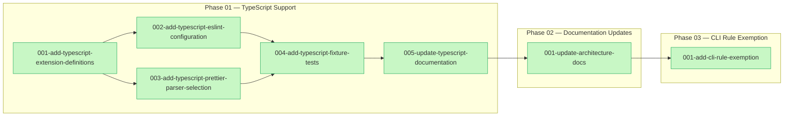
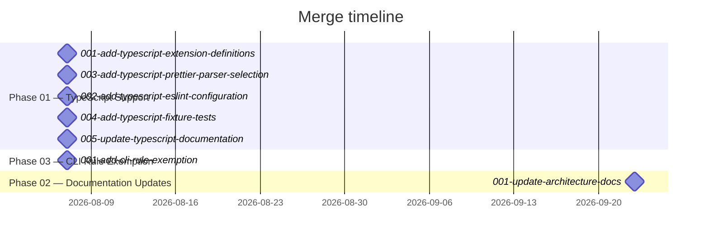

# TypeScript and TSX Support

## Purpose and scope

This plan added first-class TypeScript (`.ts`, `.mts`, `.cts`) and TSX (`.tsx`) support to
`@sdlcforge/format-and-lint` (fandl), so TypeScript sources now receive the same prettier
formatting plus syntax-level ESLint treatment that fandl already gave `.js`/`.cjs`/`.mjs`/`.jsx`.
The work unblocks a downstream rollout of fandl into six ModuleForge React/TypeScript GUI projects
that are essentially 100% `.tsx` component code fandl previously did not process at all.

Beyond the TypeScript work itself, the plan grew two adjacent phases while it was in flight: a
documentation-conformance review of fandl's architecture surface (triggered because the new
components and extension list changed a documented public API), and a `cli` ESLint config
component — discovered as a real need by a downstream consumer plan (`sdlcforge/flow`'s
adopt-fandl work) — that exempts CLI entrypoint files from `no-console`/`no-process-exit`.

Type-aware linting, a `tsconfig.json` requirement, and any change to existing
`.js`/`.cjs`/`.mjs`/`.jsx` behavior were explicitly out of scope throughout, and every task
confirmed that boundary held. All 7 tasks across the plan's three phases are complete; `make test`
and `make lint` pass at every landed commit.

## What was done

### Phase 01 — TypeScript Support

- [001-add-typescript-extension-definitions.md](./phase-01-typescript-support/001-add-typescript-extension-definitions.md) — Extended `src/lib/default-config/js-extensions.mjs` with `tsExts`/`tsxExts`/`allTsExts`/`jsxLikeExts` and their `*Str` forms, widened `allExts` to all 8 extensions, threaded the new extensions through file discovery and the `Makefile`'s `find` patterns, and added a fully-covered unit test.
- [002-add-typescript-eslint-configuration.md](./phase-01-typescript-support/002-add-typescript-eslint-configuration.md) — Added the `ts` and `tsJsdoc` ESLint config components that resolve the three verified TypeScript rule conflicts (`no-undef` on type identifiers, a circular `key-spacing`/`type-annotation-spacing` fixer loop, and de-indented `enum` bodies), with JavaScript behavior provably unchanged.
- [003-add-typescript-prettier-parser-selection.md](./phase-01-typescript-support/003-add-typescript-prettier-parser-selection.md) — Replaced the hardcoded `parser: 'babel'` in `src/lib/format-and-lint.mjs` with per-file selection (`babel-ts` for TypeScript extensions, `babel` otherwise) via a new `getPrettierConfigFor` helper.
- [004-add-typescript-fixture-tests.md](./phase-01-typescript-support/004-add-typescript-fixture-tests.md) — Added end-to-end `.ts`/`.tsx` fixture coverage across lint-detection, autofix, and formatting-idempotence axes (8 new tests, 34 → 42 total), with coverage held or improved and no production source touched.
- [005-update-typescript-documentation.md](./phase-01-typescript-support/005-update-typescript-documentation.md) — Documented the shipped TypeScript/TSX support across `src/docs/README.01.md`, `src/docs/README.02.md`, `DEVELOPER_NOTES.md`, and the regenerated `README.md`, including the known limitations.

### Phase 02 — Documentation Updates

- [001-update-architecture-docs.md](./phase-02-doc-updates/001-update-architecture-docs.md) — Conformance-reviewed fandl's architecture/specification documentation against the shipped Phase 01 work and the (by-then-also-landed) Phase 03 `cli` component, finding everything task 005 wrote already accurate and fixing one genuine staleness — a "Future versions will: support turning off individual configuration components" bullet that the `cli` component's `eslintConfigComponents: { cli: {} }` pattern had already made true today.

### Phase 03 — CLI Rule Exemption

- [001-add-cli-rule-exemption.md](./phase-03-cli-rule-exemption/001-add-cli-rule-exemption.md) — Added a `defaultCliConfig` component (`**/cli/**` path segment or `-cli` basename suffix) that turns `no-console` and `no-process-exit` off for CLI entrypoints while leaving them at `'error'` everywhere else, wired into `getEslintConfig` and pinned with six new fixture/unit tests (42 → 48 total).

## Diagrams

<!-- For AI agents and non-visual readers: a left-to-right dependency graph with one subgraph per
phase. Phase 01 shows task 001 fanning out to the parallel-eligible tasks 002 and 003, both
feeding into task 004, which feeds into task 005. Phase 01's last task feeds Phase 02's only task,
which feeds Phase 03's only task. Every node is marked done (green fill) since all 7 tasks
completed. -->

<!-- For AI agents and non-visual readers: a milestone timeline of each task's merge date. Six of
the seven tasks — all of Phase 01 and Phase 03's single task — merged on the same day (2026-08-07).
Phase 02's review task merged over six weeks later (2026-09-23), reflecting that the
documentation-conformance review ran after both the TypeScript work and the CLI rule exemption had
already landed on the plan branch. -->

## Git landmarks

| Task | Branch | Commit | Merge |
|------|--------|--------|-------|
| [001-add-typescript-extension-definitions.md](./phase-01-typescript-support/001-add-typescript-extension-definitions.md) | `plan/typescript-support-01-001` | `7f48943` | `7e3edfe2037eb241f25ea9fb29828b895dc92d86` |
| [002-add-typescript-eslint-configuration.md](./phase-01-typescript-support/002-add-typescript-eslint-configuration.md) | `plan/typescript-support-01-002` | `a2c0a18` | `769240d366ca4b27b82e83cdbc0e25df6587ff8a` |
| [003-add-typescript-prettier-parser-selection.md](./phase-01-typescript-support/003-add-typescript-prettier-parser-selection.md) | `plan/typescript-support-01-003` | `f20e979` | `d9a975aff579cb3eeb31e17752cdba3a302438b6` |
| [004-add-typescript-fixture-tests.md](./phase-01-typescript-support/004-add-typescript-fixture-tests.md) | `plan/typescript-support-01-004` | `10c502e` | `7af55eeb4877d7a269f74d5509230e618a56284f` |
| [005-update-typescript-documentation.md](./phase-01-typescript-support/005-update-typescript-documentation.md) | `plan/typescript-support-01-005` | `5f34389` | `6a874b03a28470a57b83050f30d5c2327c1aedf3` |
| [001-update-architecture-docs.md](./phase-02-doc-updates/001-update-architecture-docs.md) | `plan/typescript-support-02-001` | `da13869` | `b0218c1adcd462cfd03afac89057df5144bce13b` |
| [001-add-cli-rule-exemption.md](./phase-03-cli-rule-exemption/001-add-cli-rule-exemption.md) | `plan/typescript-support-03-001` | `65e9c0d` | `86ea84c1375014b4c52cd0995643e7429b2f51f4` |

All seven commit and merge hashes resolve via `git rev-parse`/`git show` from the plan worktree.
The recorded branch names no longer resolve to live refs — each task branch was deleted as routine
post-merge cleanup, which is expected and not a data-integrity issue.

## Follow-ups

`plan/followups.yaml` does not exist for this plan. None recorded.

Two items the plan's own documents flagged for a maintainer to revisit, though not tracked as
formal follow-ups:

- **`no-unused-vars` false positive on TypeScript constructor parameter properties**
  (`constructor(public name: string)` is reported as unused even when `this.name` is used). The
  plan deliberately kept the default (`args` detection on) rather than adding `args: 'none'`, and
  documented the limitation and workaround in `README.md`.
- **`src/lib/default-config/eslint-config.mjs` sits at exactly 300 lines**, the file's own
  `max-lines` lint cap, after Phase 03 inlined a `files` array to stay under the limit. The next
  line of code added to that file will fail `make lint` until it is split up or the cap is raised.
